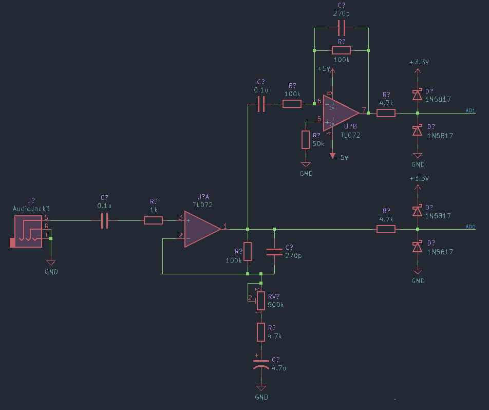
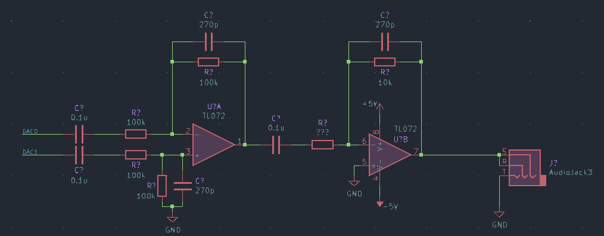
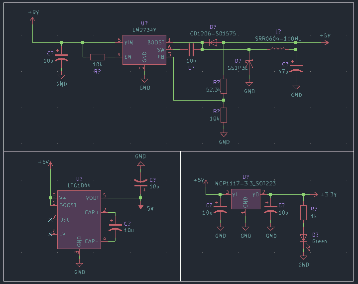

“Due Finn” is a real-time DSP guitar effects headphone amp. It is a personal project inspired by my desire to play electric guitar silently and portably. It is currently being prototyped on a breadboard.
The project is based on an open source design by [ElectroSmash](https://www.electrosmash.com/) called the [pedalSHIELD](https://www.electrosmash.com/pedalshield)

# Schematic Breakdown
## Input Stage

The input signal first passes through an active band pass filter, conditioning it to be read by the Due's ADC. A variable resistor on the feedback loop allows the gain to be adjusted manually. The output from this op amp is read by ADC0 however it also passes through an inverting amplifier. This serves two purposes. It allows the negative half of the audio waveform to be read by the ADC but it also increases the effective resolution of the ADC (from 12bit to 24bit) because the positive and negative halfs of the waveform will be read by seperate 12 bit ADCs. The seperated signals are combined later by the analogue output circuitry.

## Output Stage

After being processed, the two seperate positive and negative halfs of the waveform are written out by DAC0 and DAC1. A differential amplifier is used to recombine the seperated signals. The following op amp is redundant in it's current configuration however in future versions it can be set up as a summing amplifier with one of the inputs connected to the output of the input stage, bypassing the Due all together. This setup can be used to provide a delay effect where the original signal is summed with a delayed signal output from the Due.

## Power Management

The schematic features a 5V buck converter, 3.3V linear regulator and a +/-5V voltage converter to provide the positive and negative supply rails for the op amps.
